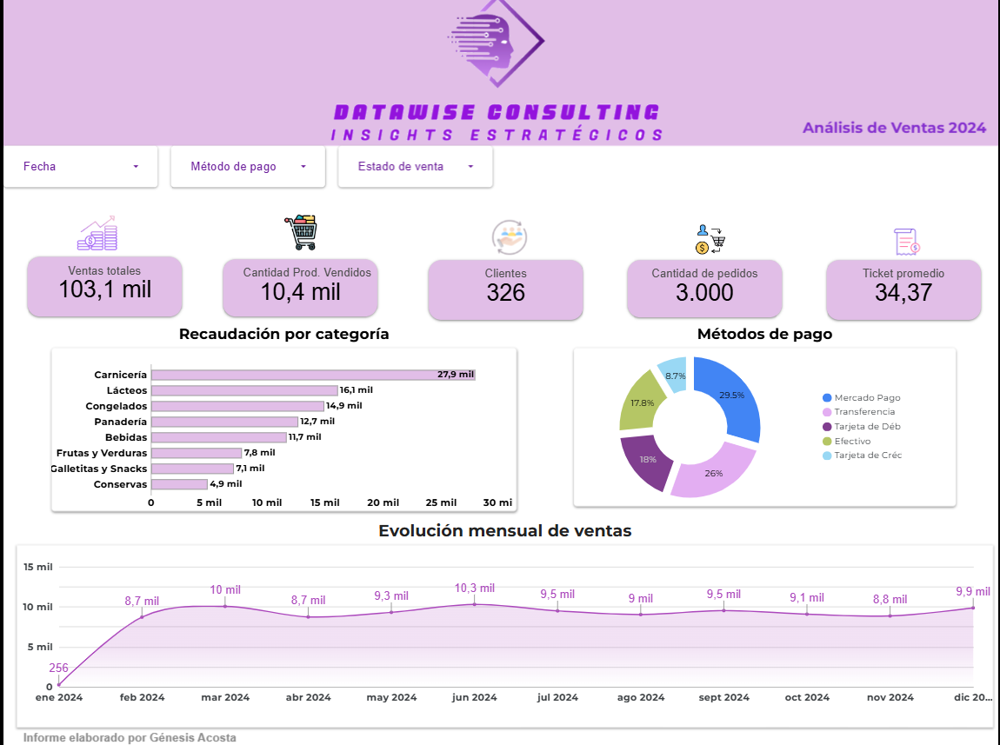
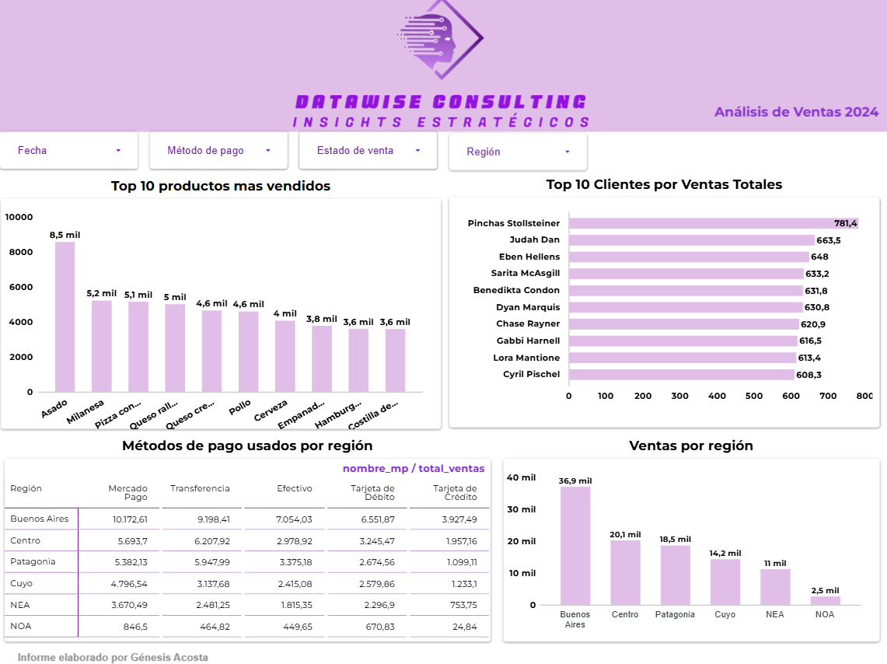

# 🛒 Dashboard Interactivo de Ventas - Supermercado

## 📌 Descripción del proyecto

Proyecto de análisis de ventas para un supermercado, desarrollado con **Google Sheets** como fuente de datos y **Looker Studio** para la creación de un dashboard interactivo.

El objetivo del proyecto es visualizar el comportamiento de las ventas, identificar productos y clientes relevantes, analizar métodos de pago y dar seguimiento a indicadores comerciales clave.

---

## 🛠️ Herramientas utilizadas

- Google Sheets
- Looker Studio
- Tablas dinámicas
- Fórmulas y métricas calculadas
- Visualización de datos

---

## 🗂️ Estructura del proyecto

El proyecto cuenta con dos hojas principales:

### `ventas`
Contiene el detalle de las ventas realizadas, incluyendo información como:

- Fecha
- Cliente
- Producto
- Categoría
- Cantidad
- Precio unitario
- Método de pago
- Estado de venta
- Total de venta

### `ventas_por_region`
Contiene información agregada para analizar ventas por región y método de pago.

---

## 📊 Dashboard principal: Ventas

### Indicadores principales

- Ventas totales
- Cantidad de productos vendidos
- Número de clientes
- Total de pedidos
- Ticket promedio

### Análisis incluidos

- Recaudación por categoría
- Distribución de métodos de pago
- Evolución mensual de ventas
- Estado de las ventas
- Comparación de ventas por producto

---

## 🌎 Dashboard: Ventas por región

### Análisis incluidos

- Ventas por región
- Métodos de pago por región
- Top 10 productos más vendidos
- Top clientes por ventas
- Comparación regional del rendimiento comercial

---

## 📈 Proceso realizado

1. Organización de los datos en Google Sheets.
2. Limpieza y revisión de campos.
3. Creación de métricas y cálculos necesarios.
4. Conexión de Google Sheets con Looker Studio.
5. Diseño de dashboards interactivos.
6. Visualización de KPIs, categorías, productos, clientes y regiones.

---

## 🔍 Insights principales

- Identificación de categorías con mayor recaudación.
- Análisis de productos con mejor desempeño en ventas.
- Visualización de clientes con mayor volumen de compra.
- Seguimiento de métodos de pago más utilizados.
- Comparación de ventas por región.
- Evaluación de la evolución mensual de las ventas.

---

## 🔗 Ver dashboard interactivo

[Ver dashboard en Looker Studio](https://datastudio.google.com/reporting/4c552343-77c9-4ffa-8e62-cb099e2b910d)

---

## 📁 Archivos incluidos

- Captura del dashboard de ventas.
- Captura del dashboard de ventas por región.
- Fuente de datos trabajada en Google Sheets.

---

## 🎯 Conclusión

Este proyecto demuestra el uso de Google Sheets y Looker Studio para construir un dashboard interactivo orientado al análisis comercial de un supermercado. Permite visualizar indicadores clave, detectar patrones de ventas y apoyar la toma de decisiones basada en datos.
